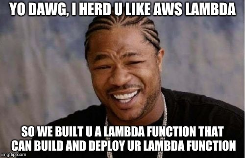

# yo-dawg
a Lambda function that can build and deploy other Lambda functions



AWS Lambda is a great tool for creating simple web services without the need to set up and maintain infrastructure.  However, once your code starts to require modules outside of the standard library, the task of packaging and deploying it can quickly devolve into a Rube Goldberg contraption.  For example, if your project requires Python's `cryptography` module, you cannot simply archive your virtualenv and upload it to Lambda unless, of course, your system is using the exact same version of OpenSSL that Lambda is.

You could go the route that many others have taken, procuring a Docker image based on the version of Amazon Linux that AWS Lambda is running on and packaging your code inside a container.  If you're pulling code from a private repository, you'll also need a secure means of automatically copying a deploy key or personal access token into the container.  Then you'll have to wait while the container launches, installs all the requirements, and uploads the resulting zip file to AWS.  When your deployment package starts to grow larger than a few megabytes, doing this repeatedly burns up a surprising amount of time.

You could also set up an EC2 instance running Amazon Linux and dedicate it to this purpose.  This is much faster but you'll have abstain from doing any system updates, lest you inadvertently break your deployment tool.  It's also costing the equivalent of a large, premium coffee every month unless you have the diligence to shut it down when you're not using it.

At this point, you may be struck by the irony of maintaining a bunch of convoluted plumbing in order to deploy serverless code, which was supposed to avoid that mess in the first place.  So why not build your project in its native environment from the start?  Well, because that comes with its own set of obstacles.  It's an immutable filesystem, so all your work will have to take place in `/tmp`.  That means your `$PATH` has to include `/tmp` first and in some cases you'll need to reference files by absolute paths.  `git` and `ssh` are also not available, nor is there a C compiler for building them.  Fortunately, there is a pure Python implementation of git called [Dulwich](https://dulwich.io/) that will handle the majority of git-related commands.  Sure, it's not as fast as a native binary, but we don't have that option in Lambda.  What we have now, though, is a two step procedure.  First, this Lambda function sets up a virtualenv containing Dulwich and its dependencies, archives that, and uploads it to S3.  Once this is done, the function can be invoked again to build any other Python projects, as long as they include a `requirements.txt` (and an optional `make_dist.sh` shell script for fine-grained control over which files to include in the final package and where to put them).  This function also strips out things that are unnecessary for deployment to Lambda, such as vendored modules, tests, and documentation, keeping the size of the package to a minimum.  With this method, you have the speed of the EC2 solution above but only pay for the Lambda invocations and S3 storage, which cost next to nothing.

### Installation
1. Copy config.ini.example to config.ini and add your AWS account info.
1. Create a Lambda function for this project along with basic IAM privileges (Lambda, S3, CloudWatch).  I'll create a CloudFormation script to automate this step at some point.
1. Run `deploy.sh`.  This will prepare the build/deploy Lambda environment for building subsequent projects.
1. From your other Lambda projects:
  1. Create a file called `make_dist.sh` and add any `mkdir` or `cp` commands required to copy deployable files to a staging directory, which will be the first script argument, i.e.```cp lambda_function.py "$1"```
  1. Invoke the build/deploy Lambda function with a payload referencing the project to be built.  You can invoke it from the AWS CLI, a shell script, or even a test event within the AWS Lambda console--whatever is convenient.  The repo name is just the name of the project, not the full URL.  For example:
```json
{
    "action": "build",
    "function": "project-to-build",
    "repo_name": "project-to-build"
}
```
